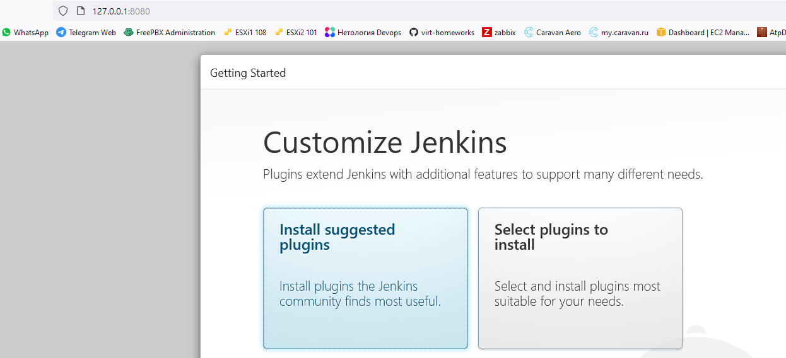

## Домашнее задание к занятию "5.4. Практические навыки работы с Docker"
#### Задача 1

В данном задании вы научитесь изменять существующие Dockerfile, адаптируя их под нужный инфраструктурный стек.

Измените базовый образ предложенного Dockerfile на Arch Linux c сохранением его функциональности.

    FROM ubuntu:latest
    
    RUN apt-get update && \
        apt-get install -y software-properties-common && \
        add-apt-repository ppa:vincent-c/ponysay && \
        apt-get update
     
    RUN apt-get install -y ponysay
    
    ENTRYPOINT ["/usr/bin/ponysay"]
    CMD ["Hey, netology”]

Для получения зачета, вам необходимо предоставить:

Написанный вами Dockerfile
    
    FROM archlinux
    RUN pacman -Syu --noconfirm 
    RUN pacman -S ponysay --noconfirm
    ENTRYPOINT ["/usr/bin/ponysay"]
    CMD ["Hey, netology”]
  
Скриншот вывода командной строки после запуска контейнера из вашего базового образа
    

Ссылку на образ в вашем хранилище docker-hub

    https://hub.docker.com/layers/166931000/mrgrav/netology/ponysay_arch/images/sha256-de6747b0a68eb562ae0f73862099389577473b1cd1a061e8427e5beec403dd9a?context=repo

#### Задача 2

В данной задаче вы составите несколько разных Dockerfile для проекта Jenkins, опубликуем образ в dockerhub.io и посмотрим логи этих контейнеров.

    Составьте 2 Dockerfile:

        Общие моменты:
            Образ должен запускать Jenkins server

        Спецификация первого образа:
            Базовый образ - amazoncorreto
            Присвоить образу тэг ver1

        Спецификация второго образа:
            Базовый образ - ubuntu:latest
            Присвоить образу тэг ver2

    Соберите 2 образа по полученным Dockerfile
    Запустите и проверьте их работоспособность
    Опубликуйте образы в своём dockerhub.io хранилище

Для получения зачета, вам необходимо предоставить:
    Наполнения 2х Dockerfile из задания

    1. Dockerfile
    FROM amazoncorretto
    COPY jenkins.war /tmp/
    CMD java -jar /tmp/jenkins.war
    
    2. Dockerfile
    FROM ubuntu:latest
    RUN apt-get update && apt-get install -y openjdk-11-jdk 
    COPY jenkins.war /tmp/
    CMD java -jar /tmp/jenkins.war

Скриншоты логов запущенных вами контейнеров (из командной строки)
    
    1. Amazon Linux
    PS C:\Users\grav\docker\jenkins1> docker run -d -ti -p 8080:8080 --name amazon ver1
    fd4a0ba4dcd14db51c423bd8b30ec7df33eca11b44d4c12e86674b611eaac6f7
    2. Ubuntu
    PS C:\Users\grav\docker\jenkins2> docker run -d -ti -p 8081:8080 --name ubuntu ver2
    3e788994080c1b3ec935a8da51758e95550809a0aafc8bc6e20d6b808699cb16
    PS C:\Users\grav\docker\jenkins2> docker ps -a
    CONTAINER ID   IMAGE     COMMAND                  CREATED              STATUS              PORTS                                       NAMES
    3e788994080c   ver2      "/bin/sh -c 'java -j…"   22 seconds ago       Up 18 seconds       0.0.0.0:8081->8080/tcp, :::8081->8080/tcp   ubuntu
    fd4a0ba4dcd1   ver1      "/bin/sh -c 'java -j…"   About a minute ago   Up About a minute   0.0.0.0:8080->8080/tcp, :::8080->8080/tcp   amazon
    
Скриншоты веб-интерфейса Jenkins запущенных вами контейнеров (достаточно 1 скриншота на контейнер)

Ссылки на образы в вашем хранилище docker-hub

    https://hub.docker.com/repository/docker/mrgrav/netology

#### Задача 3

В данном задании вы научитесь:
    объединять контейнеры в единую сеть
    исполнять команды "изнутри" контейнера
Для выполнения задания вам нужно:

    Написать Dockerfile:
        Использовать образ https://hub.docker.com/_/node как базовый
        Установить необходимые зависимые библиотеки для запуска npm приложения https://github.com/simplicitesoftware/nodejs-demo
        Выставить у приложения (и контейнера) порт 3000 для прослушки входящих запросов
        Соберите образ и запустите контейнер в фоновом режиме с публикацией порта

    Dockerfile
    FROM node
    EXPOSE 3000
    WORKDIR /usr/app
    COPY ./app ./
    RUN npm install 
    CMD npm start

    Запустить второй контейнер из образа ubuntu:latest
    PS C:\Users\grav\docker> docker run -d -ti --rm --name myubuntu ubuntu

    Создайть docker network и добавьте в нее оба запущенных контейнера
    PS C:\Users\grav\docker> docker network create mybridge
    PS C:\Users\grav\docker> docker network connect mybridge myubuntu
    PS C:\Users\grav\docker> docker network connect mybridge node

    PS C:\Users\grav\docker> docker network inspect mybridge
    [
        {
            "Name": "mybridge",
            "Id": "1dbc044973c4df926cf06673dc804c9a652393f43bdf029f139d71713116cbf9",
            "Created": "2021-09-15T08:01:28.861302404Z",
            "Scope": "local",
            "Driver": "bridge",
            "EnableIPv6": false,
            "IPAM": {
                "Driver": "default",
                "Options": {},
                "Config": [
                    {
                        "Subnet": "172.18.0.0/16",
                        "Gateway": "172.18.0.1"
                    }
            },
            "Internal": false,
            "Attachable": false,
            "Ingress": false,
            "ConfigFrom": {
                "Network": ""
            },
            "ConfigOnly": false,
            "Containers": {
                "134692925e3e1964ecf2f87c79edb5381520f12e6ac4387daa32c9bfb4968992": {
                    "Name": "node",
                    "EndpointID": "bedf08ec6d75d332cc7e5207bd41228d3cd3c097dd21e61c46c76bec1dfe5713",
                    "MacAddress": "02:42:ac:12:00:03",
                    "IPv4Address": "172.18.0.3/16",
                    "IPv6Address": ""
                },
                "9a47f392ee15eb25f81da942924480e0d037d6626af028eee9ead75fe203070a": {
                    "Name": "myubuntu",
                    "EndpointID": "e42a1ed2f06b1475db7e1ac9db5f29e65c897b340df99b593036064c0d21e75c",
                    "MacAddress": "02:42:ac:12:00:02",
                    "IPv4Address": "172.18.0.2/16",
                    "IPv6Address": ""
                }
            },
            "Options": {},
            "Labels": {}
        }
    ]

    Используя docker exec запустить командную строку контейнера ubuntu в интерактивном режиме
    PS C:\Users\grav\docker> docker exec -ti myubuntu bash

    Используя утилиту curl вызвать путь / контейнера с npm приложением
    root@9a47f392ee15:/# curl -I 172.18.0.3:3000
    HTTP/1.1 200 OK
    Cache-Control: private, no-cache, no-store, no-transform, must-revalidate
    Expires: -1
    Pragma: no-cache
    Content-Type: text/html; charset=utf-8
    Content-Length: 526208
    ETag: W/"80780-ACITPAyDVWqGLWfjYCNr7hij72Y"
    Date: Wed, 15 Sep 2021 08:12:45 GMT
    Connection: keep-alive
    Keep-Alive: timeout=5

