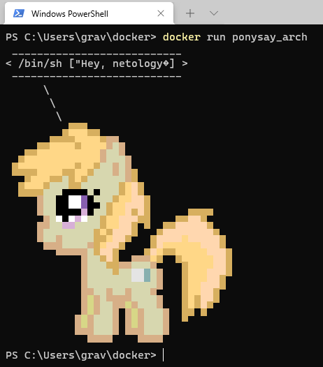
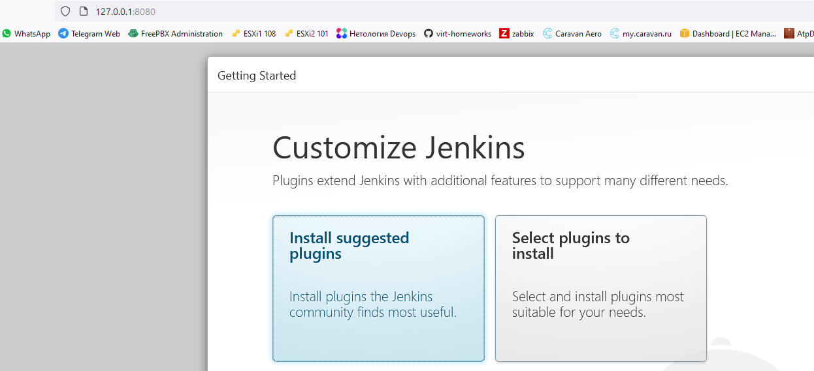

# Домашние задания
## Домашнее задание к занятию "5.4. Практические навыки работы с Docker"
#### Задача 1

В данном задании вы научитесь изменять существующие Dockerfile, адаптируя их под нужный инфраструктурный стек.

Измените базовый образ предложенного Dockerfile на Arch Linux c сохранением его функциональности.

    FROM ubuntu:latest
    
    RUN apt-get update && \
        apt-get install -y software-properties-common && \
        add-apt-repository ppa:vincent-c/ponysay && \
        apt-get update
     
    RUN apt-get install -y ponysay
    
    ENTRYPOINT ["/usr/bin/ponysay"]
    CMD ["Hey, netology”]

Для получения зачета, вам необходимо предоставить:

Написанный вами Dockerfile
    
    FROM archlinux
    RUN pacman -Syu --noconfirm 
    RUN pacman -S ponysay --noconfirm
    ENTRYPOINT ["/usr/bin/ponysay"]
    CMD ["Hey, netology”]
  
Скриншот вывода командной строки после запуска контейнера из вашего базового образа
    
    

Ссылку на образ в вашем хранилище docker-hub

    https://hub.docker.com/layers/166931000/mrgrav/netology/ponysay_arch/images/sha256-de6747b0a68eb562ae0f73862099389577473b1cd1a061e8427e5beec403dd9a?context=repo

#### Задача 2

В данной задаче вы составите несколько разных Dockerfile для проекта Jenkins, опубликуем образ в dockerhub.io и посмотрим логи этих контейнеров.

    Составьте 2 Dockerfile:

        Общие моменты:
            Образ должен запускать Jenkins server

        Спецификация первого образа:
            Базовый образ - amazoncorreto
            Присвоить образу тэг ver1

        Спецификация второго образа:
            Базовый образ - ubuntu:latest
            Присвоить образу тэг ver2

    Соберите 2 образа по полученным Dockerfile
    Запустите и проверьте их работоспособность
    Опубликуйте образы в своём dockerhub.io хранилище

Для получения зачета, вам необходимо предоставить:
    Наполнения 2х Dockerfile из задания

    1. Dockerfile
    FROM amazoncorretto
    COPY jenkins.war /tmp/
    CMD java -jar /tmp/jenkins.war
    
    2. Dockerfile
    FROM ubuntu:latest
    RUN apt-get update && apt-get install -y openjdk-11-jdk 
    COPY jenkins.war /tmp/
    CMD java -jar /tmp/jenkins.war

Скриншоты логов запущенных вами контейнеров (из командной строки)
    
    1. Amazon Linux
    PS C:\Users\grav\docker\jenkins1> docker run -d -ti -p 8080:8080 --name amazon ver1
    fd4a0ba4dcd14db51c423bd8b30ec7df33eca11b44d4c12e86674b611eaac6f7
    2. Ubuntu
    PS C:\Users\grav\docker\jenkins2> docker run -d -ti -p 8081:8080 --name ubuntu ver2
    3e788994080c1b3ec935a8da51758e95550809a0aafc8bc6e20d6b808699cb16
    PS C:\Users\grav\docker\jenkins2> docker ps -a
    CONTAINER ID   IMAGE     COMMAND                  CREATED              STATUS              PORTS                                       NAMES
    3e788994080c   ver2      "/bin/sh -c 'java -j…"   22 seconds ago       Up 18 seconds       0.0.0.0:8081->8080/tcp, :::8081->8080/tcp   ubuntu
    fd4a0ba4dcd1   ver1      "/bin/sh -c 'java -j…"   About a minute ago   Up About a minute   0.0.0.0:8080->8080/tcp, :::8080->8080/tcp   amazon
    
Скриншоты веб-интерфейса Jenkins запущенных вами контейнеров (достаточно 1 скриншота на контейнер)

    

    
Ссылки на образы в вашем хранилище docker-hub

    https://hub.docker.com/repository/docker/mrgrav/netology

#### Задача 3

В данном задании вы научитесь:
    объединять контейнеры в единую сеть
    исполнять команды "изнутри" контейнера
Для выполнения задания вам нужно:

    Написать Dockerfile:
        Использовать образ https://hub.docker.com/_/node как базовый
        Установить необходимые зависимые библиотеки для запуска npm приложения https://github.com/simplicitesoftware/nodejs-demo
        Выставить у приложения (и контейнера) порт 3000 для прослушки входящих запросов
        Соберите образ и запустите контейнер в фоновом режиме с публикацией порта

    Dockerfile
    FROM node
    EXPOSE 3000
    WORKDIR /usr/app
    COPY ./app ./
    RUN npm install 
    CMD npm start

    Запустить второй контейнер из образа ubuntu:latest
    PS C:\Users\grav\docker> docker run -d -ti --rm --name myubuntu ubuntu

    Создайть docker network и добавьте в нее оба запущенных контейнера
    PS C:\Users\grav\docker> docker network create mybridge
    PS C:\Users\grav\docker> docker network connect mybridge myubuntu
    PS C:\Users\grav\docker> docker network connect mybridge node

    PS C:\Users\grav\docker> docker network inspect mybridge
    [
        {
            "Name": "mybridge",
            "Id": "1dbc044973c4df926cf06673dc804c9a652393f43bdf029f139d71713116cbf9",
            "Created": "2021-09-15T08:01:28.861302404Z",
            "Scope": "local",
            "Driver": "bridge",
            "EnableIPv6": false,
            "IPAM": {
                "Driver": "default",
                "Options": {},
                "Config": [
                    {
                        "Subnet": "172.18.0.0/16",
                        "Gateway": "172.18.0.1"
                    }
            },
            "Internal": false,
            "Attachable": false,
            "Ingress": false,
            "ConfigFrom": {
                "Network": ""
            },
            "ConfigOnly": false,
            "Containers": {
                "134692925e3e1964ecf2f87c79edb5381520f12e6ac4387daa32c9bfb4968992": {
                    "Name": "node",
                    "EndpointID": "bedf08ec6d75d332cc7e5207bd41228d3cd3c097dd21e61c46c76bec1dfe5713",
                    "MacAddress": "02:42:ac:12:00:03",
                    "IPv4Address": "172.18.0.3/16",
                    "IPv6Address": ""
                },
                "9a47f392ee15eb25f81da942924480e0d037d6626af028eee9ead75fe203070a": {
                    "Name": "myubuntu",
                    "EndpointID": "e42a1ed2f06b1475db7e1ac9db5f29e65c897b340df99b593036064c0d21e75c",
                    "MacAddress": "02:42:ac:12:00:02",
                    "IPv4Address": "172.18.0.2/16",
                    "IPv6Address": ""
                }
            },
            "Options": {},
            "Labels": {}
        }
    ]

    Используя docker exec запустить командную строку контейнера ubuntu в интерактивном режиме
    PS C:\Users\grav\docker> docker exec -ti myubuntu bash

    Используя утилиту curl вызвать путь / контейнера с npm приложением
    root@9a47f392ee15:/# curl -I 172.18.0.3:3000
    HTTP/1.1 200 OK
    Cache-Control: private, no-cache, no-store, no-transform, must-revalidate
    Expires: -1
    Pragma: no-cache
    Content-Type: text/html; charset=utf-8
    Content-Length: 526208
    ETag: W/"80780-ACITPAyDVWqGLWfjYCNr7hij72Y"
    Date: Wed, 15 Sep 2021 08:12:45 GMT
    Connection: keep-alive
    Keep-Alive: timeout=5

## Домашнее задание к занятию "5.3. Контейнеризация на примере Docker"

#### Задача 1

Посмотрите на сценарий ниже и ответьте на вопрос: "Подходит ли в этом сценарии использование докера? Или лучше подойдет виртуальная машина, физическая машина? Или возможны разные варианты?"

Детально опишите и обоснуйте свой выбор.

--

Сценарий:

    Высоконагруженное монолитное java веб-приложение;           - виртуальная машина (нет необходимости создавать контейнеры, одно прилождение)
    Go-микросервис для генерации отчетов;                       - докер (много однотипных приложений)
    Nodejs веб-приложение;                                      - докер (много однотипных приложений)    
    Мобильное приложение c версиями для Android и iOS;          - докер (много однотипных приложений) 
    База данных postgresql используемая, как кэш;               - физическая машина (лучшее быстродействие с БД)
    Шина данных на базе Apache Kafka;                           - докер ( возможность запуска на различных узлах в сети) 
    Очередь для Logstash на базе Redis;                         - 
    Elastic stack для реализации логирования продуктивного веб-приложения - три ноды elasticsearch, два logstash и две ноды kibana; - виртуальные машины + докер (запуск нескольких приложений в рамках одной виртуальной машины)
    Мониторинг-стек на базе prometheus и grafana;               - виртуальная машина виртуальная машина (нет необходимости создавать контейнеры)
    Mongodb, как основное хранилище данных для java-приложения; - физическая машина ( лучшее быстродействие с БД)
    Jenkins-сервер.                                             - докер ( возможность запуска множества однотипных задач) 

#### Задача 2

Сценарий выполения задачи:

    создайте свой репозиторий на докерхаб;
    выберете любой образ, который содержит апачи веб-сервер;
    создайте свой форк образа;
    реализуйте функциональность: запуск веб-сервера в фоне с индекс-страницей, содержащей HTML-код ниже:

<html>
<head>
Hey, Netology
</head>
<body>
<h1>I’m kinda DevOps now</h1>
</body>
</html>

Опубликуйте созданный форк в своем репозитории и предоставьте ответ в виде ссылки на докерхаб-репо.
    
    Ссылка на репозиторий в докерхабе https://hub.docker.com/repository/docker/mrgrav/netology

#### Задача 3

    Запустите первый контейнер из образа centos c любым тэгом в фоновом режиме, подключив папку info из текущей рабочей директории на хостовой машине в /share/info контейнера;
        root@vagrant:/home# docker run --name centos-01 -v /home/vagrant/info:/share/info -d centos sleep 99999
        d8b5571ddc371fe3e1a0ef8abb2c48cc0830da1841daa345242da2e59e12a350
    Запустите второй контейнер из образа debian:latest в фоновом режиме, подключив папку info из текущей рабочей директории на хостовой машине в /info контейнера;
        root@vagrant:/home# docker run --name debian-01 -v /home/vagrant/info:/info -d debian sleep 99999
        f79d86a91855a8288d336fa19c71ecb08ddb0159f452d91aa413b5218fad6d63
    Подключитесь к первому контейнеру с помощью exec и создайте текстовый файл любого содержания в /share/info ;
        root@vagrant:/home# docker exec -ti centos-01 bash
        [root@d8b5571ddc37 /]# echo "test file" > /share/info/file.test
    Добавьте еще один файл в папку info на хостовой машине;
        root@vagrant:/home# echo "test file 1" > /home/vagrant/info/file1.test
    Подключитесь во второй контейнер и отобразите листинг и содержание файлов в /info контейнера.
        root@vagrant:/home# docker exec -ti debian-01 bash
        root@f79d86a91855:/# ls -la /info
        total 16
        drwxr-xr-x 2 root root 4096 Sep  7 09:27 .
        drwxr-xr-x 1 root root 4096 Sep  7 09:25 ..
        -rw-r--r-- 1 root root   10 Sep  7 09:26 file.test
        -rw-r--r-- 1 root root   12 Sep  7 09:27 file1.test
        

## Домашнее задание к занятию "5.2. Системы управления виртуализацией"
#### Задача 1

Выберите подходящую систему управления виртуализацией для предложенного сценария. Детально опишите ваш выбор.

Сценарии:

    100 виртуальных машин на базе Linux и Windows, общие задачи, нет особых требований  - KVM (ПО бесплатное, поддерживает различные типы ОС, хорошая производительность)
    Преимущественно Windows based инфраструктура, требуется реализация программных балансировщиков нагрузки, репликации данных и автоматизированного механизма создания резервных копий - Vmware (По хорошо работает с различными типами ОС, хороший функционал по управлению гостевыми ОС) 
    Требуется наиболее производительное бесплатное opensource решение для виртуализации небольшой (20 серверов) инфраструктуры Linux и Windows виртуальных машин -KVM (ПО бесплатное, поддерживает различные типы ОС, хорошая производительность) 
    Необходимо бесплатное, максимально совместимое и производительное решение для виртуализации Windows инфраструктуры - Hyper-V Server (ПО бесплатное, производительный, лучше совместимость с Windows)
    Необходимо рабочее окружение для тестирование программного продукта на нескольких дистрибутивах Linux - XEN (По бесплатное, наличие большего количества драйверов чем у KVM)

#### Задача 2

Опишите сценарий миграции с VMware vSphere на Hyper-V для Linux и Windows виртуальных машин. Детально опишите необходимые шаги для использования всех преимуществ Hyper-V для Windows.
    
    1. Скачиваем например на жесткий диск файлы диска виртуальной машины с VMWare в формате vmdk
    2. С помощью V@VConverter перегоняем файл в формат vhd (есть способы обойтись без конвертера)
    3. Кладем файл например на диск с Hyper-V
    4. Создаем новую виртуальную машину Hyper-V, но на вкладке "виртуальный диск" не создаем новый, а подключаем нужный.

    Приемущества Hyper-V для Windows
    - лучшая совместимость среди гипервизоров для работы с ОС Windows
    - возможность реальзации паравиртуализации
    - высокое быстродействие

#### Задача 3

Опишите возможные проблемы и недостатки гетерогенной среды виртуализации (использования нескольких систем управления виртуализацией одновременно) и что необходимо сделать для минимизации этих рисков и проблем. Если бы у вас был бы выбор, то создавали ли вы бы гетерогенную среду или нет? Мотивируйте ваш ответ примерами.

    Минусы гетерогенное среды
    - сложность в управлении несколькими системами (резервное копирование, мониторинг систем и пр)
    - необходимо наличие большего количества навыков для работы с несколькими системами управления
    - хуже обеспечивается доступность ресурсов (виртуальных машин)

    Я бы не стал делать гетерогенную среду из-за того, что хуже обеспечивается доступность ресурсов. 
    Например. в пределах одной системы виртуализации можно свободно перемещать виртуальные машины с одного хоста на другой, без потери их функциональности.

## Домашнее задание к занятию "5.1. Основы виртуализации"

#### Задача 1. 
Вкратце опишите, как вы поняли - в чем основное отличие паравиртуализации и виртуализации на основе ОС.
    
    Основное отличеме в том, что при паравиртуализации часть запросов идет на прямую к железу хоста минуя гипервизор (ОС хоста).  

#### Задача 2. 
Выберите тип один из вариантов использования организации физических серверов, в зависимости от условий использования.
Организация серверов:
    
    физические сервера
    паравиртуализация
    виртуализация уровня ОС

Условия использования:

    Высоконагруженная база данных, чувствительная к отказу      - физические серверы (т.к. при прямом доступе к железу (без виртуальных устройств) увеличивается быстродействие системы)
    Различные Java-приложения                                   - виртуализауция уровня ОС (возможна работа нескольких экземпляров пространства пользователя в рамках одной ОС с наименьшим потреблением ресурсов)
    Windows системы для использования Бухгалтерским отделом     - паравиртуализация (не требует наличия различных гостевых ОС)
    Системы, выполняющие высокопроизводительные расчеты на GPU  - физические серверы (т.к. при прямом доступе к железу (без виртуальных устройств) увеличивается быстродействие системы)

Опишите, почему вы выбрали к каждому целевому использованию такую организацию.

#### Задача 3
Как вы думаете, возможно ли совмещать несколько типов виртуализации на одном сервере? Приведите пример такого совмещения.

    Возможно. На хост устанавливается гипервизор, например VmWare, далее устанавливаем 2 гостевых сервера у одного сервера выбираем паравиртуальный контроллер дисковыой подсистемы. у другого виртуальный и на этот же гостевой сервер  же ставим ОС в которой будут созданы контейнеры для приложенийю 

## Домашнее задание к занятию "4.2. Использование Python для решения типовых DevOps задач"
#### 1.Есть скрипт:

    #!/usr/bin/env python3
    a = 1
    b = '2'
    c = a + b

        Какое значение будет присвоено переменной c?    - значение не будет присвоено, нельзя сложить целове и строку
        Как получить для переменной c значение 12?      - c=int(str(a)+b)  
        Как получить для переменной c значение 3?       - c=a+int(b)

#### 2.Мы устроились на работу в компанию, где раньше уже был DevOps Engineer. Он написал скрипт, позволяющий узнать, какие файлы модифицированы в репозитории, относительно локальных изменений. Этим скриптом недовольно начальство, потому что в его выводе есть не все изменённые файлы, а также непонятен полный путь к директории, где они находятся. Как можно доработать скрипт ниже, чтобы он исполнял требования вашего руководителя?
    Исходная версия
    #!/usr/bin/env python3

    import os
    
    bash_command = ["cd ~/netology/sysadm-homeworks", "git status"]
    result_os = os.popen(' && '.join(bash_command)).read()
    is_change = False
    for result in result_os.split('\n'):
        if result.find('modified') != -1:
            prepare_result = result.replace('\tmodified:   ', '')
            print(prepare_result)
            break
    
    Измененная версия 
    #!/usr/bin/env python3
    
    import os
    
    bash_command = ["cd ~/gitwork", "pwd", "git status"]            
    result_os = os.popen(' && '.join(bash_command)).read()
    #is_change = False                                              -лишнее
    cwd=result_os.split('\n')                                       -получаем директорию репозитория
    for result in result_os.split('\n'):
        if result.find('modified') != -1:
            prepare_result = cwd[0]+'/'+result.replace('\tmodified:   ', '') -выводи директорию и имя файла
            print(prepare_result)
            #break                                                  - убираем прерывание цикла

#### 3.Доработать скрипт выше так, чтобы он мог проверять не только локальный репозиторий в текущей директории, а также умел воспринимать путь к репозиторию, который мы передаём как входной параметр. Мы точно знаем, что начальство коварное и будет проверять работу этого скрипта в директориях, которые не являются локальными репозиториями.
    #!/usr/bin/env python3
    
    import os
    import sys
    
    bash_command = ["cd "+sys.argv[1], "pwd", "git status"]         - добавили передачу аргумента в скрипт
    result_os = os.popen(' && '.join(bash_command)).read()          
    cwd=result_os.split('\n')
    for result in result_os.split('\n'):
        if result.find('modified') != -1:
            prepare_result = cwd[0]+'/'+result.replace('\tmodified:   ', '')
            print(prepare_result)

#### 4.Наша команда разрабатывает несколько веб-сервисов, доступных по http. Мы точно знаем, что на их стенде нет никакой балансировки, кластеризации, за DNS прячется конкретный IP сервера, где установлен сервис. Проблема в том, что отдел, занимающийся нашей инфраструктурой очень часто меняет нам сервера, поэтому IP меняются примерно раз в неделю, при этом сервисы сохраняют за собой DNS имена. Это бы совсем никого не беспокоило, если бы несколько раз сервера не уезжали в такой сегмент сети нашей компании, который недоступен для разработчиков. Мы хотим написать скрипт, который опрашивает веб-сервисы, получает их IP, выводит информацию в стандартный вывод в виде: <URL сервиса> - <его IP>. Также, должна быть реализована возможность проверки текущего IP сервиса c его IP из предыдущей проверки. Если проверка будет провалена - оповестить об этом в стандартный вывод сообщением: [ERROR] <URL сервиса> IP mismatch: <старый IP> <Новый IP>. Будем считать, что наша разработка реализовала сервисы: drive.google.com, mail.google.com, google.com.

## Домашнее задание к занятию "4.1. Командная оболочка Bash: Практические навыки"
#### 1.Есть скрипт:

    a=1                 - результат 1 т.к. неявное определение целочисленного
    b=2                 - результат 2 т.к. неявное определение целочисленного
    c=a+b               - результат a+b, т.к. это строка, а не значения переменных 
    d=$a+$b             - результат 1+2,т.к. это строка, в которую занесли выражение со значениями переменных
    e=$(($a+$b))        - результат 3, т.к. берется значение опреации над значениями переменных a и b

        Какие значения переменным c,d,e будут присвоены?
        Почему?

#### 2.На нашем локальном сервере упал сервис и мы написали скрипт, который постоянно проверяет его доступность, записывая дату проверок до тех пор, пока сервис не станет доступным. В скрипте допущена ошибка, из-за которой выполнение не может завершиться, при этом место на Жёстком Диске постоянно уменьшается. Что необходимо сделать, чтобы его исправить:

    while ((1==1)
    do
    curl https://localhost:4757
    if (($? != 0))
    then
    date >> curl.log
    else
    break           - добавим условие выхода из цикла по доступности сервиса.
    fi
    done

#### 3.Необходимо написать скрипт, который проверяет доступность трёх IP: 192.168.0.1, 173.194.222.113, 87.250.250.242 по 80 порту и записывает результат в файл log. Проверять доступность необходимо пять раз для каждого узла.
    #!/usr/bin/env bash
    addr=(192.168.0.1 173.194.222.113 87.250.250.242)
    for i in ${addr[@]}
    do
        for ((j=0; j < 5; j++))
        do
        curl http://$i > curl.log
        done        
    done

#### 4.Необходимо дописать скрипт из предыдущего задания так, чтобы он выполнялся до тех пор, пока один из узлов не окажется недоступным. Если любой из узлов недоступен - IP этого узла пишется в файл error, скрипт прерывается

    #!/usr/bin/env bash
    addr=(192.168.0.1 173.194.222.113 87.250.250.242)
    while ((1==1))
    for i in ${addr[@]}
    do
        for ((j=0; j < 5; j++))
        do
        curl http://$i > curl.log
        if ($? !=0) 
            then 
              echo $i is down > curl.log
              break
        fi
        done        
    done

## Домашнее задание к занятию "3.9. Элементы безопасности информационных систем"

#### 1.Запустить Vault-сервер в dev-режиме (дополнив ключ -dev упомянутым выше -dev-listen-address, если хотите увидеть UI).
    Запустили сервер в одном терминале
    vagrant@vagrant:/etc/vault.d$ vault server -dev -dev-listen-address="0.0.0.0:8200"
    Выполнили настройки в другом терминале
    vagrant@vagrant:~$ export VAULT_ADDR='http://127.0.0.1:8200'
    vagrant@vagrant:~$ export VAULT_TOKEN="s.POAsCLMr5h4TOiwsPRmFoFHm"
    vagrant@vagrant:~$ vault status
    Key             Value
    ---             -----
    Seal Type       shamir
    Initialized     true
    Sealed          false
    Total Shares    1
    Threshold       1
    Version         1.7.3
    Storage Type    inmem
    Cluster Name    vault-cluster-8df0087c
    Cluster ID      c1fbc3fb-382e-bf9d-f6c9-b2e27aeb6b58
    HA Enabled      false

#### 3.Используя PKI Secrets Engine, создайте Root CA и Intermediate CA. Обратите внимание на дополнительные материалы по созданию CA в Vault, если с изначальной инструкцией возникнут сложности.
    
    vagrant@vagrant:~$ vault secrets enable pki                     - монтируем pki
    Success! Enabled the pki secrets engine at: pki/
    vagrant@vagrant:~$ vault secrets tune -max-lease-ttl=87600h pki  - увеличили максимальное время жизни сертификата до 10 лет
    Success! Tuned the secrets engine at: pki/
    Создаем root
    vault write pki/root/generate/internal common_name=myvault.com ttl=87600h
    Key              Value
    ---              -----
    certificate      -----BEGIN CERTIFICATE-----
    MIIDNTCCAh2gAwIBAgIUf5NwQ0WefoUUyc

    Публикуем URL’ы для корневого центра сертификации
    vagrant@vagrant:~$ vault write pki/config/urls issuing_certificates="http://vault.example.com:8200/v1/pki/ca" crl_distribution_points="http://vault.example.com:8200/v1/pki/crl"
    Success! Data written to: pki/config/urls
    
    Создаем роль, с помощью которой будем выдавать сертификаты для серверов    
    vagrant@vagrant:~$ vault write pki/roles/example-dot-com \allowed_domains=example.com \allow_subdomains=true max_ttl=72h
    Success! Data written to: pki/roles/example-dot-com

    Создаем Intermediate CA
    vagrant@vagrant:~$ vault secrets enable -path=pki_int pki -монтируем
    Success! Enabled the pki secrets engine at: pki_int/
    vagrant@vagrant:~$ vault secrets tune -max-lease-ttl=43800h pki_int - устанавливаем срок на 5 лет
    Success! Tuned the secrets engine at: pki_int/
    
    Создаем запрос
    vault write pki_int/intermediate/generate/internal common_name="myvault.com Intermediate Authority" ttl=43800h
    Key    Value
    ---    -----
    csr    -----BEGIN CERTIFICATE REQUEST-----
    MIICcjCCAVoC......

    Сертификат для промежуточного центра сертификации
    vagrant@vagrant:~$ vault write pki/root/sign-intermediate csr=@int.csr format=pem_bundle ttl=43800h
    Key              Value
    ---              -----
    certificate      -----BEGIN CERTIFICATE-----
    MIIDtjC......
    
    Публикуем подписанный сертификат
    vagrant@vagrant:~$ vault write pki_int/intermediate/set-signed certificate=@int.pem
    Success! Data written to: pki_int/intermediate/set-signed
    
    Публикуем URL’ы для промежуточного центра сертификации
    vagrant@vagrant:~$ vault write pki_int/config/urls issuing_certificates="http://127.0.0.1:8200/v1/pki_int/ca" crl_distribution_points="http://127.0.0.1:8200/v1/pki_int/crl"
    Success! Data written to: pki_int/config/urls
    
    Создаем роль
    vagrant@vagrant:~$ vault write pki_int/roles/example-dot-com \allowed_domains=example.com \allow_subdomains=true max_ttl=72h
    Success! Data written to: pki_int/roles/example-dot-com
    
 
#### 4.Согласно этой же инструкции, подпишите Intermediate CA csr на сертификат для тестового домена (например, netology.example.com если действовали согласно инструкции).
    Создаем запрос
    vagrant@vagrant:~$ vault write pki_int_netology/intermediate/generate/internal common_name="netology.example.com" ttl=43800h
    Key    Value
    ---    -----
    csr    -----BEGIN CERTIFICATE REQUEST-----
    MIICl......
    
    Получаем сертификат
    vagrant@vagrant:~$ vault write pki/root/sign-intermediate csr=@int_netology.csr format=pem_bundle ttl=43800h
    Key              Value
    ---              -----
    certificate      -----BEGIN CERTIFICATE-----
    MIIDyz.....
    
    Публикуем подписанный сертификат
    vagrant@vagrant:~$ vault write pki_int_netology/intermediate/set-signed certificate=@int_netology.pem
    Success! Data written to: pki_int_netology/intermediate/set-signed

    Создаем роль
    vagrant@vagrant:~$ vault write pki_int_netology/roles/example-dot-com \allowed_domains=example.com \allow_subdomains=true max_ttl=72h
    Success! Data written to: pki_int_netology/roles/example-dot-com

    Выпускаем сертификат
    vagrant@vagrant:~$ vault write pki_int_netology/issue/example-dot-com \common_name=netology.example.com
    Key                 Value
    ---                 -----
    ca_chain            [-----BEGIN CERTIFICATE-----
    MIID...

  
#### 5.Поднимите на localhost nginx, сконфигурируйте default vhost для использования подписанного Vault Intermediate CA сертификата и выбранного вами домена. Сертификат из Vault подложить в nginx руками.
    Конфигурируем nginx
    server {
    listen 443 ssl;
    server_name netology.example.com www.netology.example.com;
    access_log /var/log/nginx/netology-example-com.access.log;
    root /var/www/netology.example.com/public_html/;
    index index.html index.htm;
    ssl_certificate /home/vagrant/netology1.pem;
    ssl_certificate_key /home/vagrant/netology1.pem;
    location / {
    try_files $uri $uri/ =404;
    }
    }

#### 6.Модифицировав /etc/hosts и системный trust-store, добейтесь безошибочной с точки зрения HTTPS работы curl на ваш тестовый домен (отдающийся с localhost). Рекомендуется добавлять в доверенные сертификаты Intermediate CA. Root CA добавить было бы правильнее, но тогда при конфигурации nginx потребуется включить в цепочку Intermediate, что выходит за рамки лекции. Так же, пожалуйста, не добавляйте в доверенные сам сертификат хоста.
    добавляем в hosts запись 127.0.0.1 netology.example.com
    
    Добавляем Issuing CA в доверенные и обновляем список
    vagrant@vagrant:~$ sudo ln -s /home/vagrant/netology_iss.crt /usr/local/share/ca-certificates/netology_iss.crt
    vagrant@vagrant:~$ sudo  update-ca-certificates
    Updating certificates in /etc/ssl/certs...
    1 added, 0 removed; done.
    Running hooks in /etc/ca-certificates/update.d...
    done.
    
    Проверяем работу
    vagrant@vagrant:~$ curl https://netology.example.com
    It's wooooork!
    vagrant@vagrant:~$ curl -I -s https://netology.example.com
    HTTP/1.1 200 OK
    Server: nginx/1.18.0 (Ubuntu)
    Date: Mon, 26 Jul 2021 05:13:09 GMT
    Content-Type: text/html
    Content-Length: 15
    Last-Modified: Mon, 26 Jul 2021 03:05:16 GMT
    Connection: keep-alive
    ETag: "60fe266c-f"
    Accept-Ranges: bytes

## Домашнее задание к занятию "3.8. Компьютерные сети, лекция 3"

#### 1.ipvs. Если при запросе на VIP сделать подряд несколько запросов (например, for i in {1..50}; do curl -I -s 172.28.128.200>/dev/null; done ), ответы будут получены почти мгновенно. Тем не менее, в выводе ipvsadm -Ln еще некоторое время будут висеть активные InActConn. Почему так происходит?
    Мы будем видеть запись в столбце InActConn до тех пор, пока не истечет время ожидания соединения(для некоторых сервисов таких, как http/1.0, ftp-data). 
#### 2.На лекции мы познакомились отдельно с ipvs и отдельно с keepalived. Воспользовавшись этими знаниями, совместите технологии вместе (VIP должен подниматься демоном keepalived). Приложите конфигурационные файлы, которые у вас получились, и продемонстрируйте работу получившейся конструкции. Используйте для директора отдельный хост, не совмещая его с риалом! Подобная схема возможна, но выходит за рамки рассмотренного на лекции.
    Исходные данные
   
      'netology1'  '172.28.128.10',  хост пользователя 
      'netology2'  '172.28.128.20',  балансер 1
      'netology3'  '172.28.128.30',  балансер 2
      'netology4'  '172.28.128.40',  сервер 1
      'netology5'  '172.28.128.50',  сервер 2
 
    Файлы конфигурации 

    vrrp_instance VI_1 {
            state BACKUP
            interface eth1
            virtual_router_id 33
            priority 100
            advert_int 1
            authentication {
                    auth_type PASS
                    auth_pass netology
            }
            virtual_ipaddress {
                    172.28.128.200/32 dev eth1
            }
    }

    vrrp_instance VI_2 {
            state BACKUP
            interface eth1
            virtual_router_id 33
            priority 50
            advert_int 1
            authentication {
                    auth_type PASS
                    auth_pass netology
            }
            virtual_ipaddress {
                    172.28.128.200/32 dev eth1
            }
    }
    
 

    Делаем запрос на серверы с хоста пользователя
    vagrant@netology1:~$ for i in {1..50}; do curl -I -s 172.28.128.200>/dev/null; done
    
    Состояние балансера 1
    root@netology2:~# systemctl status keepalived
    ● keepalived.service - Keepalive Daemon (LVS and VRRP)
         Loaded: loaded (/lib/systemd/system/keepalived.service; enabled; vendor preset: enabled)
         Active: active (running) since Mon 2021-07-12 09:30:26 UTC; 6min ago
       Main PID: 993 (keepalived)
          Tasks: 2 (limit: 1072)
         Memory: 1.4M
         CGroup: /system.slice/keepalived.service
                 ├─ 993 /usr/sbin/keepalived --dont-fork
                 └─1004 /usr/sbin/keepalived --dont-fork
    
    Jul 12 09:30:26 netology2 Keepalived[993]: Starting VRRP child process, pid=1004
    Jul 12 09:30:26 netology2 Keepalived_vrrp[1004]: Registering Kernel netlink reflector
    Jul 12 09:30:26 netology2 Keepalived_vrrp[1004]: Registering Kernel netlink command channel
    Jul 12 09:30:26 netology2 Keepalived_vrrp[1004]: Opening file '/etc/keepalived/keepalived.conf'.
    Jul 12 09:30:26 netology2 Keepalived_vrrp[1004]: Registering gratuitous ARP shared channel
    Jul 12 09:30:26 netology2 Keepalived_vrrp[1004]: (VI_1) Entering BACKUP STATE (init)
    Jul 12 09:30:26 netology2 Keepalived_vrrp[1004]: (VI_1) received lower priority (50) advert from 172.28.128.30 - discarding
    Jul 12 09:30:27 netology2 Keepalived_vrrp[1004]: (VI_1) received lower priority (50) advert from 172.28.128.30 - discarding
    Jul 12 09:30:28 netology2 Keepalived_vrrp[1004]: (VI_1) received lower priority (50) advert from 172.28.128.30 - discarding
    Jul 12 09:30:29 netology2 Keepalived_vrrp[1004]: (VI_1) Entering MASTER STATE

    root@netology2:~# ipvsadm -Ln --stats
    IP Virtual Server version 1.2.1 (size=4096)
    Prot LocalAddress:Port               Conns   InPkts  OutPkts  InBytes OutBytes
      -> RemoteAddress:Port
    TCP  172.28.128.200:80                  50      300        0    19950        0
      -> 172.28.128.40:80                   25      150        0     9975        0
      -> 172.28.128.50:80                   25      150        0     9975        0
    
    Состояние балансера 2    
    root@netology3:~# systemctl status keepalived
    ● keepalived.service - Keepalive Daemon (LVS and VRRP)
         Loaded: loaded (/lib/systemd/system/keepalived.service; enabled; vendor preset: enabled)
         Active: active (running) since Mon 2021-07-12 09:31:38 UTC; 8s ago
       Main PID: 13777 (keepalived)
          Tasks: 2 (limit: 1072)
         Memory: 1.5M
         CGroup: /system.slice/keepalived.service
                 ├─13777 /usr/sbin/keepalived --dont-fork
                 └─13781 /usr/sbin/keepalived --dont-fork
    
    Jul 12 09:31:38 netology3 Keepalived[13777]: Starting Keepalived v2.0.19 (10/19,2019)
    Jul 12 09:31:38 netology3 Keepalived[13777]: WARNING - keepalived was build for newer Linux 5.4.18, running on Linux 5.4.0-73-generic #82-Ubuntu SMP Wed Apr 14 17:39>
    Jul 12 09:31:38 netology3 Keepalived[13777]: Command line: '/usr/sbin/keepalived' '--dont-fork'
    Jul 12 09:31:38 netology3 Keepalived[13777]: Opening file '/etc/keepalived/keepalived.conf'.
    Jul 12 09:31:38 netology3 Keepalived[13777]: Starting VRRP child process, pid=13781
    Jul 12 09:31:38 netology3 Keepalived_vrrp[13781]: Registering Kernel netlink reflector
    Jul 12 09:31:38 netology3 Keepalived_vrrp[13781]: Registering Kernel netlink command channel
    Jul 12 09:31:38 netology3 Keepalived_vrrp[13781]: Opening file '/etc/keepalived/keepalived.conf'.
    Jul 12 09:31:38 netology3 Keepalived_vrrp[13781]: Registering gratuitous ARP shared channel
    Jul 12 09:31:38 netology3 Keepalived_vrrp[13781]: (VI_2) Entering BACKUP STATE (init)

    Роняем интерфейс eth1 на балансере 1 в даун ip link set eth1 down
    Состояние балансера 1
    Jul 12 09:40:55 netology2 Keepalived_vrrp[1004]: Netlink reports eth1 down
    Jul 12 09:40:55 netology2 Keepalived_vrrp[1004]: (VI_1) Entering FAULT STATE
    Jul 12 09:40:55 netology2 Keepalived_vrrp[1004]: (VI_1) sent 0 priority
    Балансер 2 переходит в стостояние Master
    Jul 12 09:31:38 netology3 Keepalived_vrrp[13781]: (VI_2) Entering BACKUP STATE (init)
    Jul 12 09:41:00 netology3 Keepalived_vrrp[13781]: (VI_2) Entering MASTER STATE
    
    Запускаем 50 запросов c хоста пользователя и смотрим состояние второго балансера
    root@netology3:~# ipvsadm -Ln --stats
    IP Virtual Server version 1.2.1 (size=4096)
    Prot LocalAddress:Port               Conns   InPkts  OutPkts  InBytes OutBytes
      -> RemoteAddress:Port
    TCP  172.28.128.200:80                  50      300        0    19950        0
      -> 172.28.128.40:80                   25      150        0     9975        0
      -> 172.28.128.50:80                   25      150        0     9975        0
    
    Записи на серверах 1 и 2
    root@netology4:/var/log/nginx# wc -l /var/log/nginx/access.log
    52 /var/log/nginx/access.log
    root@netology5:/var/log/nginx# wc -l /var/log/nginx/access.log
    50 /var/log/nginx/access.log
#### 3.В лекции мы использовали только 1 VIP адрес для балансировки. У такого подхода несколько отрицательных моментов, один из которых – невозможность активного использования нескольких хостов (1 адрес может только переехать с master на standby). Подумайте, сколько адресов оптимально использовать, если мы хотим без какой-либо деградации выдерживать потерю 1 из 3 хостов при входящем трафике 1.5 Гбит/с и физических линках хостов в 1 Гбит/с? Предполагается, что мы хотим задействовать 3 балансировщика в активном режиме (то есть не 2 адреса на 3 хоста, один из которых в обычное время простаивает).
    Для оптимальной работы нам необходимо 6 адресов на 3 хоста, у каждого хоста будет по 2 адреса и при выходе из строя одного из них, по одному адресу хоста перекинуть на соседние балансировщики.
    Тогда максимальная нагрузка на хосты при потере одного из них будет по 750Мбит.
## Домашнее задание к занятию "3.7. Компьютерные сети, лекция 2"

#### 1.На лекции мы обсудили, что манипулировать размером окна необходимо для эффективного наполнения приемного буфера участников TCP сессии (Flow Control). Подобная проблема в полной мере возникает в сетях с высоким RTT. Например, если вы захотите передать 500 Гб бэкап из региона Юга-Восточной Азии на Восточное побережье США. Здесь вы можете увидеть и 200 и 400 мс вполне реального RTT. Подсчитайте, какого размера нужно окно TCP чтобы наполнить 1 Гбит/с канал при 300 мс RTT (берем простую ситуацию без потери пакетов). Можно воспользоваться готовым калькулятором. Ознакомиться с формулами, по которым работает калькулятор можно, например, на Wiki.
    1 000 000 000 бит/с * 0.3 с = 300 000 000 бит / 8 = 37 500 000 байтов.
    maximum throughput with a TCP window of 37500 KByte and RTT of 300.0 ms <= 1024.00 Mbit/sec.

#### 2.Во сколько раз упадет пропускная способность канала, если будет 1% потерь пакетов при передаче?
    В 1000 раз.

#### 3.Какая максимальная реальная скорость передачи данных достижима при линке 100 Мбит/с? Вопрос про TCP payload, то есть цифры, которые вы реально увидите в операционной системе в тестах или в браузере при скачивании файлов. Повлияет ли размер фрейма на это?
    максимальная полезная нагрузка (Payload) TCP в сетях Ethernet будет:
    Max TCP Payload= (MTU–TCP–IP) / (MTU+Ethernet+IFG) = (1500–20-20) / (1500+7+1+6+6+2+4+12) = 94.9 % (94.9 Мбит/c)
    Размер фрейма напрамую влияет на скорость передачи, маленькие фреймы передают больше служебной информации, полезной соответственно меньше.  

#### 4.Что на самом деле происходит, когда вы открываете сайт? :) На прошлой лекции был приведен сокращенный вариант ответа на этот вопрос. Теперь вы знаете намного больше, в частности про IP адресацию, DNS и т.д. Опишите максимально подробно насколько вы это можете сделать, что происходит, когда вы делаете запрос curl -I http://netology.ru с вашей рабочей станции. Предположим, что arp кеш очищен, в локальном DNS нет закешированных записей.
    1. Хост запрашивает броадкастом МАС адрес шлюза для отправки последующих фреймов и получает его
    PcsCompu_e3:90:c5	Broadcast	ARP	42	Who has 10.0.2.3? Tell 10.0.2.15
    RealtekU_12:35:03	PcsCompu_e3:90:c5	ARP	60	10.0.2.3 is at 52:54:00:12:35:03
    
    2.Хост делает запрос DNS 
    tcpdump
    10.0.2.15	8.8.8.8	DNS	82	Standard query 0x938d A netology.ru OPT
    
    3.DNS сервер отвечает
    tcpdump
    8.8.8.8	10.0.2.15	DNS	130	Standard query response 0x938d A netology.ru A 172.67.43.83 A 104.22.48.171 A 104.22.49.171 OPT
    
    4. Устанавливается соединение
    strace
    connect(5, {sa_family=AF_INET, sin_port=htons(80), sin_addr=inet_addr("172.67.43.83")}, 16) = -1 EINPROGRESS (Operation now in progress)
    getpeername(5, {sa_family=AF_INET, sin_port=htons(80), sin_addr=inet_addr("172.67.43.83")}, [128->16]) = 0
    getsockname(5, {sa_family=AF_INET, sin_port=htons(54274), sin_addr=inet_addr("10.0.2.15")}, [128->16]) = 0
    tcpdump
    10.0.2.15	172.67.43.83	TCP	74	54274 → 80 [SYN] Seq=0 Win=64240 Len=0 MSS=1460 SACK_PERM=1 TSval=2431559582 TSecr=0 WS=128
    172.67.43.83	10.0.2.15	TCP	60	80 → 54274 [SYN, ACK] Seq=0 Ack=1 Win=65535 Len=0 MSS=1460
	10.0.2.15	172.67.43.83	TCP	54	54274 → 80 [ACK] Seq=1 Ack=1 Win=64240 Len=0
    
    5. Отправляем запрос по HTTP
    strace
    sendto(5, "HEAD / HTTP/1.1\r\nHost: netology.ru\r\nUser-Agent: curl/7.68.0\r\nAccept: */*\r\n\r\n", 76, MSG_NOSIGNAL, NULL, 0) = 76
    tcpdump
    10.0.2.15	172.67.43.83	HTTP	130	HEAD / HTTP/1.1 
	172.67.43.83	10.0.2.15	TCP	60	80 → 54274 [ACK] Seq=1 Ack=77 Win=65535 Len=0
	Перенаправление на HTTPSб получение информации
    strace
    recvfrom(5, "HTTP/1.1 301 Moved Permanently\r\nDate: Wed, 07 Jul 2021 09:45:08 GMT\r\nConnection: keep-alive\r\nCache-Control: max-age=3600\r\nExpires: Wed, 07 Jul 2021 10:45:08 GMT\r\nLocation: https://netology.ru/\r\ncf-req"..., 102400, 0, NULL, NULL) = 397
    tcpdump
    172.67.43.83	10.0.2.15	HTTP	451	HTTP/1.1 301 Moved Permanently 
	10.0.2.15	172.67.43.83	TCP	54	54274 → 80 [ACK] Seq=77 Ack=398 Win=63843 Len=0
    Вывод полученной информации
    strace
    write(1, "HTTP/1.1 301 Moved Permanently\r\n", 32) = 32
    write(1, "\33[1mDate\33[0m: Wed, 07 Jul 2021 09:45:08 GMT\r\n", 45) = 45
    write(1, "\33[1mConnection\33[0m: keep-alive\r\n", 32) = 32
    write(1, "\33[1mCache-Control\33[0m: max-age=3600\r\n", 37) = 37
    write(1, "\33[1mExpires\33[0m: Wed, 07 Jul 2021 10:45:08 GMT\r\n", 48) = 48
    write(1, "\33[1mLocation\33[0m: https://netology.ru/\r\n", 40) = 40
    write(1, "\33[1mcf-request-id\33[0m: 0b21f473f700004ed324045000000001\r\n", 57) = 57
    write(1, "\33[1mServer\33[0m: cloudflare\r\n", 28) = 28
    write(1, "\33[1mCF-RAY\33[0m: 66b02366583d4ed3-FRA\r\n", 38) = 38
    write(1, "\33[1malt-svc\33[0m: h3-27=\":443\"; ma=86400, h3-28=\":443\"; ma=86400, h3-29=\":443\"; ma=86400, h3=\":443\"; ma=86400\r\n", 110) = 110
    write(1, "\r\n", 2)                     = 2

    6.Завершение соединения
    tcpdump
	10.0.2.15	172.67.43.83	TCP	54	54274 → 80 [FIN, ACK] Seq=77 Ack=398 Win=63843 Len=0
	172.67.43.83	10.0.2.15	TCP	60	80 → 54274 [ACK] Seq=398 Ack=78 Win=65535 Len=0
	172.67.43.83	10.0.2.15	TCP	60	80 → 54274 [FIN, ACK] Seq=398 Ack=78 Win=65535 Len=0
	10.0.2.15	172.67.43.83	TCP	54	54274 → 80 [ACK] Seq=78 Ack=399 Win=63843 Len=0
    
#### 5.Сколько и каких итеративных запросов будет сделано при резолве домена www.google.co.uk?
    Если запускать команду vagrant@vagrant:~$ dig google.co.uk тогда выполнится:
    1. один рекурсивный запрос к DNS серверу по умолчанию (например 8.8.8.8)
    2. DNS сервер далее выполнит итеративные запросы ко всем серверам 
    .                       42118   IN      NS      a.root-servers.net.
    .                       42118   IN      NS      c.root-servers.net.
    .                       42118   IN      NS      h.root-servers.net.
    .                       42118   IN      NS      g.root-servers.net.
    .                       42118   IN      NS      f.root-servers.net.
    .                       42118   IN      NS      d.root-servers.net.
    .                       42118   IN      NS      e.root-servers.net.
    .                       42118   IN      NS      i.root-servers.net.
    .                       42118   IN      NS      l.root-servers.net.
    .                       42118   IN      NS      k.root-servers.net.
    .                       42118   IN      NS      b.root-servers.net.
    .                       42118   IN      NS      m.root-servers.net.
    .                       42118   IN      NS      j.root-servers.net.
    далее 
    uk.                     172800  IN      NS      nsc.nic.uk.
    uk.                     172800  IN      NS      nsa.nic.uk.
    uk.                     172800  IN      NS      dns1.nic.uk.
    uk.                     172800  IN      NS      dns4.nic.uk.
    uk.                     172800  IN      NS      dns3.nic.uk.
    uk.                     172800  IN      NS      nsd.nic.uk.
    uk.                     172800  IN      NS      nsb.nic.uk.
    uk.                     172800  IN      NS      dns2.nic.uk.
    далее
    google.co.uk.           172800  IN      NS      ns1.google.com.
    google.co.uk.           172800  IN      NS      ns2.google.com.
    google.co.uk.           172800  IN      NS      ns3.google.com.
    google.co.uk.           172800  IN      NS      ns4.google.com.
    далее
    google.co.uk.           300     IN      A       64.233.164.94
    3. DNS сервер 8.8.8.8 вернет нам ip адрес сервера  google.co.uk - 64.233.164.94. 

#### 6.Сколько доступно для назначения хостам адресов в подсети /25? А в подсети с маской 255.248.0.0. Постарайтесь потренироваться в ручных вычислениях чтобы немного набить руку, не пользоваться калькулятором сразу.
    В подсети /25 - 126 адресов.
    В подсети с маской 255.248.0.0 - 524 286 адресов

#### 7.В какой подсети больше адресов, в /23 или /24?
    В /23 адресов больше

#### 8.Получится ли разделить диапазон 10.0.0.0/8 на 128 подсетей по 131070 адресов в каждой? Какая маска будет у таких подсетей?
    Разделить получиться на 128 подсетей в каждой по 131070 хостов, маска будет /15.

## Домашнее задание к занятию "3.6. Компьютерные сети, лекция 1"
#### 2.Узнайте о том, сколько действительно независимых (не пересекающихся) каналов есть в разделяемой среде WiFi при работе на 2.4 ГГц. Стандарты с полосой 5 ГГц более актуальны, но регламенты на 5 ГГц существенно различаются в разных странах, а так же не раз обновлялись. В качестве дополнительного вопроса вне зачета, попробуйте найти актуальный ответ и на этот вопрос.
    При работе на частоте 2.4 Ггц есть 3 независимых канала (1,6,11). 
    Согласно Постановление Правительства РФ от 12 октября 2004 г. N 539 (с изм от 11 июня 2021 г.) в России разрешены устройства внутри закрытых помещений в полосах радиочастот 5150 - 5350 МГц, 5650 - 5850 МГц.

#### 3.Адрес канального уровня – MAC адрес – это 6 байт, первые 3 из которых называются OUI – Organizationally Unique Identifier или уникальный идентификатор организации. Какому производителю принадлежит MAC 38:f9:d3:55:55:79?
    Принадлежит производителю Apple.

#### 4.Каким будет payload TCP сегмента, если Ethernet MTU задан в 9001 байт, размер заголовков IPv4 – 20 байт, а TCP – 32 байта?
    9001-20-32=8949

#### 5.Могут ли во флагах TCP одновременно быть установлены флаги SYN и FIN при штатном режиме работы сети? Почему да или нет?
    Флаги SYN и FIN при штатной работе сети одновременно не могут быть установлены поскольку эти флаги требуют как установления соединения (через SYN), так и завершения соединения (через FIN). 

#### 6. ss -ula sport = :53 на хосте имеет следующий вывод:

    State           Recv-Q          Send-Q                   Local Address:Port                     Peer Address:Port          Process
    UNCONN          0               0                        127.0.0.53%lo:domain                        0.0.0.0:*

    Почему в State присутствует только UNCONN, и может ли там присутствовать, например, TIME-WAIT?
    
    Отображаться статус UNCONN, т.к. этот протокол не подразумевает предварительное открытие подключений. TIME-WAIT присутствовать не может, потому что это состояние завершения соединения TCP. 

#### 7.Обладая знаниями о том, как штатным образом завершается соединение (FIN от инициатора, FIN-ACK от ответчика, ACK от инициатора), опишите в каких состояниях будет находиться TCP соединение в каждый момент времени на клиенте и на сервере при завершении. Схема переходов состояния соединения вам в этом поможет.
    Состояние           Состояние клиента           Состояние сервера
    FIN-WAIT-1          посылает FIN серверу        ожидание
    CLOSE-WAIT          ожидание                    подтверждает FIN сегментом АСК
    FIN-WAIT-2          получил ACK, ожидание       продолжает передачу
    LAST-ACK            ожидание FIN                заканчивает передачу и отправляет FIN клиенту                        
    TIME-WAIT           получил FIN,отправил ACK    ждет АСK 
    CLOSING             закрывает соединение        закрывает соединение

#### 8.TCP порт – 16 битное число. Предположим, 2 находящихся в одной сети хоста устанавливают между собой соединения. Каким будет теоретическое максимальное число соединений, ограниченное только лишь параметрами L4, которое параллельно может установить клиент с одного IP адреса к серверу с одним IP адресом? Сколько соединений сможет обслужить сервер от одного клиента? А если клиентов больше одного?
    С одного IP адреса может подключиться до 65535 клиентов. Таким образом, теоретическое максимальное число соединений может быть равно число клиентских IP адресов * число портов на клиенте (65535) .

#### 9.Может ли сложиться ситуация, при которой большое число соединений TCP на хосте находятся в состоянии TIME-WAIT? Если да, то является ли она хорошей или плохой? Подкрепите свой ответ пояснением той или иной оценки.
    В большинстве случаев это нормальное и ожидаемое поведение. Однако много соединений в состоянии "TIME_WAIT" может привести к тому, что приложение исчерпает порты для соединений к клиентскому сокету.

#### 10.Чем особенно плоха фрагментация UDP относительно фрагментации TCP?
    Фрагментация плоха тем, что в протокол не гарантирует доставку и могут терятся пакеты. 
    Например, трафик может проходить через брандмауэры, которые могут отбрасывать фрагментированный пакет UDP, поскольку он был получен не по порядку и брэндмауэр не смог идентифицировать используемое приложение

#### 11.Если бы вы строили систему удаленного сбора логов, то есть систему, в которой несколько хостов отправяют на центральный узел генерируемые приложениями логи (предположим, что логи – текстовая информация), какой протокол транспортного уровня вы выбрали бы и почему? Проверьте ваше предположение самостоятельно, узнав о стандартном протоколе syslog.
    Я бы выбрал гарантированную доставку, т.к. сообщения от систем бывают очень важными и их потеря может привести к неработоспособности системы. Но стандартный протокол использует UDP.
    Хотя есть rfc6587 от апреля 2012 года где описываются механизмы доставки посредством ТСР.

#### 12.Сколько портов TCP находится в состоянии прослушивания на вашей виртуальной машине с Ubuntu, и каким процессам они принадлежат?
    vagrant@vagrant:~$ ss -l -t
    State        Recv-Q       Send-Q               Local Address:Port                 Peer Address:Port       Process
    LISTEN       0            4096                       0.0.0.0:sunrpc                    0.0.0.0:*
    LISTEN       0            4096                 127.0.0.53%lo:domain                    0.0.0.0:*
    LISTEN       0            128                        0.0.0.0:ssh                       0.0.0.0:*
    LISTEN       0            4096                          [::]:sunrpc                       [::]:*
    LISTEN       0            128                           [::]:ssh                          [::]:*
    vagrant@vagrant:~$ ss -l -t | wc -l
    6

    vagrant@vagrant:~$ sudo lsof -ni | grep LISTEN
    systemd      1            root   35u  IPv4  15601      0t0  TCP *:sunrpc (LISTEN)
    systemd      1            root   37u  IPv6  15605      0t0  TCP *:sunrpc (LISTEN)
    rpcbind    559            _rpc    4u  IPv4  15601      0t0  TCP *:sunrpc (LISTEN)
    rpcbind    559            _rpc    6u  IPv6  15605      0t0  TCP *:sunrpc (LISTEN)
    systemd-r  560 systemd-resolve   13u  IPv4  22805      0t0  TCP 127.0.0.53:domain (LISTEN)
    sshd       811            root    3u  IPv4  24843      0t0  TCP *:ssh (LISTEN)
    sshd       811            root    4u  IPv6  24854      0t0  TCP *:ssh (LISTEN)

#### 13.Какой ключ нужно добавить в tcpdump, чтобы он начал выводить не только заголовки, но и содержимое фреймов в текстовом виде? А в текстовом и шестнадцатиричном?
    для просмотра содержимого нужно использовать параметр -A. Вывод содержимого будет в формате ASCII.
    sudo tcpdump -A
    -X можно отобразить вывод в шестнадцатеричном формате
    sudo tcpdump -X

#### 14.Попробуйте собрать дамп трафика с помощью tcpdump на основном интерфейсе вашей виртуальной машины и посмотреть его через tshark или Wireshark (можно ограничить число пакетов -c 100). Встретились ли вам какие-то установленные флаги Internet Protocol (не флаги TCP, а флаги IP)? Узнайте, какие флаги бывают. Как на самом деле называется стандарт Ethernet, фреймы которого попали в ваш дамп? Можно ли где-то в дампе увидеть OUI?
    Встретились флаги Internet Protocol -.1.. .... = Don't fragment: Set
    Стандарт Ethernet называется IEEE 802.3
    OUI можно увидеть в разделе - Ethernet II, Src: PcsCompu_e3:90:c5 (08:00:27:e3:90:c5), Dst: RealtekU_12:35:02 (52:54:00:12:35:02)

## Домашнее задание к занятию "3.5. Файловые системы"

#### 2.Могут ли файлы, являющиеся жесткой ссылкой на один объект, иметь разные права доступа и владельца? Почему?
    Не могут, потому что с точки зрения файловой системы все жесткие ссылки эквивалентны.

#### 5.Используя sfdisk, перенесите данную таблицу разделов на второй диск.
    root@vagrant:~# sfdisk -d /dev/sdb | sfdisk /dev/sdc
    Checking that no-one is using this disk right now ... OK
    
    Disk /dev/sdc: 2.51 GiB, 2684354560 bytes, 5242880 sectors
    Disk model: VBOX HARDDISK
    Units: sectors of 1 * 512 = 512 bytes
    Sector size (logical/physical): 512 bytes / 512 bytes
    I/O size (minimum/optimal): 512 bytes / 512 bytes
    
    >>> Script header accepted.
    >>> Script header accepted.
    >>> Script header accepted.
    >>> Script header accepted.
    >>> Created a new DOS disklabel with disk identifier 0x07298470.
    /dev/sdc1: Created a new partition 1 of type 'Linux' and of size 2 GiB.
    /dev/sdc2: Created a new partition 2 of type 'Linux' and of size 511 MiB.
    /dev/sdc3: Done.
    
    New situation:
    Disklabel type: dos
    Disk identifier: 0x07298470
    
    Device     Boot   Start     End Sectors  Size Id Type
    /dev/sdc1          2048 4196351 4194304    2G 83 Linux
    /dev/sdc2       4196352 5242879 1046528  511M 83 Linux
    
    The partition table has been altered.
    Calling ioctl() to re-read partition table.
    Syncing disks.
#### 6.Соберите mdadm RAID1 на паре разделов 2 Гб.
    root@vagrant:~# mdadm --create --verbose /dev/md0 -l 1 -n 2 /dev/sd{b,c}1
    mdadm: Note: this array has metadata at the start and
        may not be suitable as a boot device.  If you plan to
        store '/boot' on this device please ensure that
        your boot-loader understands md/v1.x metadata, or use
        --metadata=0.90
    mdadm: size set to 2094080K
    Continue creating array? y
    mdadm: Defaulting to version 1.2 metadata
    mdadm: array /dev/md0 started.
#### 7.Соберите mdadm RAID0 на второй паре маленьких разделов.
    root@vagrant:~# mdadm --create --verbose /dev/md1 -l 0 -n 2 /dev/sd{b,c}2
    mdadm: chunk size defaults to 512K
    mdadm: /dev/sdb2 appears to be part of a raid array:
           level=raid1 devices=2 ctime=Tue Jun 29 04:38:21 2021
    mdadm: /dev/sdc2 appears to be part of a raid array:
           level=raid1 devices=2 ctime=Tue Jun 29 04:38:21 2021
    Continue creating array? y
    mdadm: Defaulting to version 1.2 metadata
    mdadm: array /dev/md1 started.
#### 8.Создайте 2 независимых PV на получившихся md-устройствах.
    root@vagrant:~# sudo pvcreate /dev/md0 /dev/md1
    Physical volume "/dev/md0" successfully created.
    Physical volume "/dev/md1" successfully created
.
#### 9.Создайте общую volume-group на этих двух PV.
    root@vagrant:~# vgcreate vg00  /dev/md0 /dev/md1
    Volume group "vg00" successfully created
#### 10.Создайте LV размером 100 Мб, указав его расположение на PV с RAID0.
    lvcreate -L 100M -n disk_1 vg00 /dev/md1

#### 11.Создайте mkfs.ext4 ФС на получившемся LV.
    root@vagrant:~# mkfs.ext4 /dev/vg00/disk_1
    mke2fs 1.45.5 (07-Jan-2020)
    Creating filesystem with 25600 4k blocks and 25600 inodes
    
    Allocating group tables: done
    Writing inode tables: done
    Creating journal (1024 blocks): done
    Writing superblocks and filesystem accounting information: done
#### 12.Смонтируйте этот раздел в любую директорию, например, /tmp/new.
    root@vagrant:~# mkdir /tmp/new
    root@vagrant:~# mount /dev/vg00/disk_1 /tmp/new

#### 13.Поместите туда тестовый файл, например wget https://mirror.yandex.ru/ubuntu/ls-lR.gz -O /tmp/new/test.gz.
    root@vagrant:~# ll /tmp/new
    total 20448
    drwxr-xr-x  3 root root     4096 Jun 29 08:18 ./
    drwxrwxrwt 11 root root     4096 Jun 29 08:16 ../
    drwx------  2 root root    16384 Jun 29 08:15 lost+found/
    -rw-r--r--  1 root root 20913436 Jun 29 07:28 test.gz
#### 14.Прикрепите вывод lsblk.
    root@vagrant:~# lsblk
    NAME                 MAJ:MIN RM  SIZE RO TYPE  MOUNTPOINT
    sda                    8:0    0   64G  0 disk
    ├─sda1                 8:1    0  512M  0 part  /boot/efi
    ├─sda2                 8:2    0    1K  0 part
    └─sda5                 8:5    0 63.5G  0 part
      ├─vgvagrant-root   253:0    0 62.6G  0 lvm   /
      └─vgvagrant-swap_1 253:1    0  980M  0 lvm   [SWAP]
    sdb                    8:16   0  2.5G  0 disk
    ├─sdb1                 8:17   0    2G  0 part
    │ └─md0                9:0    0    2G  0 raid1
    └─sdb2                 8:18   0  511M  0 part
      └─md1                9:1    0 1018M  0 raid0
        └─vg00-disk_1    253:2    0  100M  0 lvm   /tmp/new
    sdc                    8:32   0  2.5G  0 disk
    ├─sdc1                 8:33   0    2G  0 part
    │ └─md0                9:0    0    2G  0 raid1
    └─sdc2                 8:34   0  511M  0 part
      └─md1                9:1    0 1018M  0 raid0
        └─vg00-disk_1    253:2    0  100M  0 lvm   /tmp/new

#### 15.Протестируйте целостность файла:
    root@vagrant:~# gzip -t /tmp/new/test.gz
    root@vagrant:~# echo $?
    0

#### 16.Используя pvmove, переместите содержимое PV с RAID0 на RAID1.
    root@vagrant:~# pvmove /dev/md1 /dev/md0
    /dev/md1: Moved: 72.00%
    /dev/md1: Moved: 100.00%

#### 17.Сделайте --fail на устройство в вашем RAID1 md.
    root@vagrant:~# mdadm --fail /dev/md0 /dev/sdb1
    mdadm: set /dev/sdb1 faulty in /dev/md0
    root@vagrant:~# cat /proc/mdstat
    Personalities : [linear] [multipath] [raid0] [raid1] [raid6] [raid5] [raid4] [raid10]
    md1 : active raid0 sdc2[1] sdb2[0]
          1042432 blocks super 1.2 512k chunks
    
    md0 : active raid1 sdc1[1] sdb1[0](F)
          2094080 blocks super 1.2 [2/1] [_U]

#### 18.Подтвердите выводом dmesg, что RAID1 работает в деградированном состоянии.
    root@vagrant:~# dmesg | grep md0
    [10169.399390] md/raid1:md0: Disk failure on sdb1, disabling device.
                   md/raid1:md0: Operation continuing on 1 devices.

#### 19.Протестируйте целостность файла, несмотря на "сбойный" диск он должен продолжать быть доступен:
    root@vagrant:~# gzip -t /tmp/new/test.gz
    root@vagrant:~# echo $?
    0

## Домашнее задание к занятию "3.4. Операционные системы, лекция 2"
#### 1.Node Exporter
    unit-файл
    vagrant@vagrant:~$ cat /etc/systemd/system/node_exporter.service
    [Unit]
    Description=Node Exporter
    After=network-online.target
    
    [Service]
    User=node_exporter
    Group=node_exporter
    Type=simple
    EnvironmentFile=-/etc/default/node_exporter
    ExecStart=/usr/local/bin/node_exporter $EXTRA_OPTS
    
    [Install]
    WantedBy=multi-user.target    
    
    файл с параметрами
    vagrant@vagrant:~$ cat /etc/default/node_exporter
    EXTRA_OPTS="--collector.disable-defaults --collector.cpu --collector.meminfo --collector.filesystem --collector.netdev"

    systemctl daemon-reload
    systemctl enable node_exporter
    systemctl start node_exporter
    systemctl status node_exporter
    Jun 25 02:27:05 vagrant node_exporter[1692]: level=info ts=2021-06-25T02:27:05.894Z caller=node_exporter.go:179 msg="Build context" build_context="(go=go1.15.8, user>Jun 25 02:27:05 vagrant node_exporter[1692]: level=info ts=2021-06-25T02:27:05.895Z caller=filesystem_common.go:74 collector=filesystem msg="Parsed flag --collector.>Jun 25 02:27:05 vagrant node_exporter[1692]: level=info ts=2021-06-25T02:27:05.895Z caller=filesystem_common.go:76 collector=filesystem msg="Parsed flag --collector.>Jun 25 02:27:05 vagrant node_exporter[1692]: level=info ts=2021-06-25T02:27:05.895Z caller=node_exporter.go:106 msg="Enabled collectors"
    Jun 25 02:27:05 vagrant node_exporter[1692]: level=info ts=2021-06-25T02:27:05.895Z caller=node_exporter.go:113 collector=cpu
    Jun 25 02:27:05 vagrant node_exporter[1692]: level=info ts=2021-06-25T02:27:05.895Z caller=node_exporter.go:113 collector=filesystem
    Jun 25 02:27:05 vagrant node_exporter[1692]: level=info ts=2021-06-25T02:27:05.895Z caller=node_exporter.go:113 collector=meminfo
    Jun 25 02:27:05 vagrant node_exporter[1692]: level=info ts=2021-06-25T02:27:05.896Z caller=node_exporter.go:113 collector=netdev
    Jun 25 02:27:05 vagrant node_exporter[1692]: level=info ts=2021-06-25T02:27:05.896Z caller=node_exporter.go:195 msg="Listening on" address=:9100
    Jun 25 02:27:05 vagrant node_exporter[1692]: level=info ts=2021-06-25T02:27:05.896Z caller=tls_config.go:191 msg="TLS is disabled." http2=false

#### 2.Ознакомьтесь с опциями node_exporter и выводом /metrics по-умолчанию. Приведите несколько опций, которые вы бы выбрали для базового мониторинга хоста по CPU, памяти, диску и сети.
    --collector.cpu 
    --collector.meminfo 
    --collector.filesystem 
    --collector.netdev

#### 4.Можно ли по выводу dmesg понять, осознает ли ОС, что загружена не на настоящем оборудовании, а на системе виртуализации?
    Да можно, есть много сообщений про систему виртуализации, например:
    Booting paravirtualized kernel on KVM
    Detected virtualization oracle.

#### 5.Как настроен sysctl fs.nr_open на системе по-умолчанию? Узнайте, что означает этот параметр. Какой другой существующий лимит не позволит достичь такого числа (ulimit --help)?
    Значение по умолчанияю для максимального значения дескрипторов fs.nr_open = 1024*1024 (1048576)
    Ulimit органичивает ресурсы на текущую сессию - open files (-n) 1024.
#### 6.Запустите любой долгоживущий процесс (не ls, который отработает мгновенно, а, например, sleep 1h) в отдельном неймспейсе процессов; покажите, что ваш процесс работает под PID 1 через nsenter. Для простоты работайте в данном задании под root (sudo -i). Под обычным пользователем требуются дополнительные опции (--map-root-user) и т.д.
    vagrant@vagrant:~$ sudo unshare -f --pid --mount-proc sleep 1h
    vagrant@vagrant:~$ ps aux | grep sleep
    root        2539  0.0  0.0   8076   528 pts/0    S    12:37   0:00 sleep 1h
    
    vagrant@vagrant:~$ sudo nsenter --target 2539 --pid --mount
    root@vagrant:/# ps aux
    USER         PID %CPU %MEM    VSZ   RSS TTY      STAT START   TIME COMMAND
    root           1  0.0  0.0   8076   528 pts/0    S+   12:37   0:00 sleep 1h
    root           2  0.0  0.3   9836  4012 pts/1    S    12:53   0:00 -bash
    root          11  0.0  0.3  11492  3396 pts/1    R+   12:53   0:00 ps aux
#### 7. Найдите информацию о том, что такое :(){ :|:& };:. Запустите эту команду в своей виртуальной машине Vagrant с Ubuntu 20.04 (это важно, поведение в других ОС не проверялось). Некоторое время все будет "плохо", после чего (минуты) – ОС должна стабилизироваться. Вызов dmesg расскажет, какой механизм помог автоматической стабилизации. Как настроен этот механизм по-умолчанию, и как изменить число процессов, которое можно создать в сессии?
    :(){ :|:& };: = это форк-бомба, функция, которая порождает себя n-раз, до исчерпания ресурссов системы.
    
    Механизм автоматической стабилизации - fork rejected by pids controller in /user.slice/user-1000.slice/session-3.scope
    Ограничение максимального числа задач.
    По умолчанию TaskMax равен 33% (от ограничений user.slice и зависит от размера оперативной памяти выделенной ОС), его можно увеличить в файле /usr/lib/systemd/system/user-.slice.d/10-defaults.conf
    vagrant@vagrant:~$ systemctl status
    ● vagrant
        State: running
         Jobs: 0 queued
       Failed: 0 units
        Since: Sat 2021-06-26 04:40:28 UTC; 1h 12min ago
       CGroup: /
               ├─user.slice
               │ └─user-1000.slice

## Домашнее задание к занятию "3.3. Операционные системы, лекция 1"

#### 1.Какой системный вызов делает команда cd? В прошлом ДЗ мы выяснили, что cd не является самостоятельной программой, это shell builtin, поэтому запустить strace непосредственно на cd не получится. Тем не менее, вы можете запустить strace на /bin/bash -c 'cd /tmp'. В этом случае вы увидите полный список системных вызовов, которые делает сам bash при старте. Вам нужно найти тот единственный, который относится именно к cd.

    chdir("/tmp")

#### 2.Попробуйте использовать команду file на объекты разных типов на файловой системе. Например:

    vagrant@netology1:~$ file /dev/tty
    /dev/tty: character special (5/0)
    vagrant@netology1:~$ file /dev/sda
    /dev/sda: block special (8/0)
    vagrant@netology1:~$ file /bin/bash
    /bin/bash: ELF 64-bit LSB shared object, x86-64

    Используя strace выясните, где находится база данных file на основании которой она делает свои догадки.

    База данных находится в /usr/share/misc/magic.mgc
    
#### 3.Предположим, приложение пишет лог в текстовый файл. Этот файл оказался удален (deleted в lsof), однако возможности сигналом сказать приложению переоткрыть файлы или просто перезапустить приложение – нет. Так как приложение продолжает писать в удаленный файл, место на диске постепенно заканчивается. Основываясь на знаниях о перенаправлении потоков предложите способ обнуления открытого удаленного файла (чтобы освободить место на файловой системе).

    vagrant@vagrant:~/big$ cat /dev/urandom >> logfile
    vagrant@vagrant:~/big$ rm logfile
    vagrant@vagrant:~/big$ lsof | grep cat
    lsof: WARNING: can't stat() tracefs file system /sys/kernel/debug/tracing
      Output information may be incomplete.
    cat       2747                        vagrant  cwd       DIR              253,0       4096     131098 /home/vagrant/big
    cat       2747                        vagrant  rtd       DIR              253,0       4096          2 /
    cat       2747                        vagrant  txt       REG              253,0      43416    1310756 /usr/bin/cat
    cat       2747                        vagrant  mem       REG              253,0    5699248    1321336 /usr/lib/locale/locale-archive
    cat       2747                        vagrant  mem       REG              253,0    2029224    1313864 /usr/lib/x86_64-linux-gnu/libc-2.31.so
    cat       2747                        vagrant  mem       REG              253,0     191472    1313821 /usr/lib/x86_64-linux-gnu/ld-2.31.so
    cat       2747                        vagrant    0u      CHR              136,1        0t0          4 /dev/pts/1
    cat       2747                        vagrant    1w      REG              253,0 1750372352     131101 /home/vagrant/big/logfile (deleted)
    cat       2747                        vagrant    2u      CHR              136,1        0t0          4 /dev/pts/1
    cat       2747                        vagrant    3r      CHR                1,9        0t0         11 /dev/urandom
    cat       2747                        vagrant    9u      CHR              136,1        0t0          4 /dev/pts/1
    vagrant@vagrant:~/big$ cat /dev/null > /proc/2747/fd/1
    
#### 4.Занимают ли зомби-процессы какие-то ресурсы в ОС (CPU, RAM, IO)?

    Зомби процессы не занимают ресурсы в ОС (CPU, RAM, IO). 
    Они блокируют записи в таблице процессов, размер которой ограничен для каждого пользователя и системы в целом. 
    Т.е. приводит к «утечке ресурсов» в виде накопления записей в таблице процессов.    

#### 5.В iovisor BCC есть утилита opensnoop:

    root@vagrant:~# dpkg -L bpfcc-tools | grep sbin/opensnoop
    /usr/sbin/opensnoop-bpfcc

    На какие файлы вы увидели вызовы группы open за первую секунду работы утилиты? Воспользуйтесь пакетом bpfcc-tools для Ubuntu 20.04. Дополнительные сведения по установке.

    PID    COMM               FD ERR PATH
    796    vminfo              5   0 /var/run/utmp
    585    dbus-daemon        -1   2 /usr/local/share/dbus-1/system-services
    585    dbus-daemon        16   0 /usr/share/dbus-1/system-services
    585    dbus-daemon        -1   2 /lib/dbus-1/system-services
    585    dbus-daemon        16   0 /var/lib/snapd/dbus-1/system-services/
#### 6.Какой системный вызов использует uname -a? Приведите цитату из man по этому системному вызову, где описывается альтернативное местоположение в /proc, где можно узнать версию ядра и релиз ОС.
    
    Используется системный вызов uname - получает название ядра и информацию о нем. 
    Цитата из man об альтернативном местоположении информации - Part of the utsname information is also accessible via /proc/sys/kernel/{ostype, hostname, osrelease, version, domainname}.

#### 7.Чем отличается последовательность команд через ; и через && в bash? Например:

    root@netology1:~# test -d /tmp/some_dir; echo Hi
    Hi
    root@netology1:~# test -d /tmp/some_dir && echo Hi
    root@netology1:~#

    ; — оператор последовательного выполнения нескольких команд. Каждая последующая команда начинает выполняться только после завершения предыдущей (неважно, успешного или нет);
    && — оператор выполнения команды только после успешного выполнения предыдущей;

    Есть ли смысл использовать в bash &&, если применить set -e?
    -e немедленный выход при выполнении команды с ненулевым результатом,
    Смысл использовать && есть, т.к. если будет нулевой результат выполнения команды до &&, то выполнение продолжится.
 
#### 8.Из каких опций состоит режим bash set -euxo pipefail и почему его хорошо было бы использовать в сценариях?
    
    -e скрипт немедленно завершит работу, если любая команда выйдет с ошибкой.
    -u проверяет инициализацию переменных в скрипте. Если переменной не будет, скрипт немедленно завершиться.  
    -x bash печатает в стандартный вывод все команды перед их исполнением.
    -o чтобы убедиться, что все команды в пайпах завершились успешно.

#### 9.Используя -o stat для ps, определите, какой наиболее часто встречающийся статус у процессов в системе. В man ps ознакомьтесь (/PROCESS STATE CODES) что значат дополнительные к основной заглавной буквы статуса процессов. Его можно не учитывать при расчете (считать S, Ss или Ssl равнозначными).

    Наиболее часто встречающийся стстус - S    interruptible sleep. 
    Дополнительные символы к основной букве выводят расширенную информацию о процессе (приоритет процесса, имеет заблокированные страницы в памяти и др.) 

## Домашнее задание к занятию "3.1. Работа в терминале, лекция 2"

#### 1.Какого типа команда cd? Попробуйте объяснить, почему она именно такого типа; опишите ход своих мыслей, если считаете что она могла бы быть другого типа.
    Команда CD является внутренней командой, встроенной в оболочку. Возможно сделано для того чтобы она везде работала одинаково и пользователям нельзя было переопределять ее функционал.

#### 2.Какая альтернатива без pipe команде grep <some_string> <some_file> | wc -l? man grep поможет в ответе на этот вопрос. Ознакомьтесь с документом о других подобных некорректных вариантах использования pipe.
    альтернативная команда grep <some_string> <some_file> -с выведет количество строк, содержащих <some_string>. 

#### 3.Какой процесс с PID 1 является родителем для всех процессов в вашей виртуальной машине Ubuntu 20.04?
    процесс с PID 1 systemd является родителем для всех процессов.

#### 4.Как будет выглядеть команда, которая перенаправит вывод stderr ls на другую сессию терминала?
    ls /root 2>/dev/pts/1
#### 5.Получится ли одновременно передать команде файл на stdin и вывести ее stdout в другой файл? Приведите работающий пример.
    vagrant@vagrant:~$ cat <list.in >list.out

#### 6.Получится ли вывести находясь в графическом режиме данные из PTY в какой-либо из эмуляторов TTY? Сможете ли вы наблюдать выводимые данные?
    Вывести данные из PTY в TTY можно cat /dev/pts/1 > /dev/tty1. Вводимые данные можно наблюдать.

#### 7.Выполните команду bash 5>&1. К чему она приведет? Что будет, если вы выполните echo netology > /proc/$$/fd/5? Почему так происходит?
    bash 5>&1 - перенаправит stdout в файловый дискриптор 5. 
    echo netology > /proc/$$/fd/5 - выведет строку netology, т.к. переопределен стандартный вывод на файловый дискриптор 5. 

#### 8.Получится ли в качестве входного потока для pipe использовать только stderr команды, не потеряв при этом отображение stdout на pty? Напоминаем: по умолчанию через pipe передается только stdout команды слева от | на stdin команды справа. Это можно сделать, поменяв стандартные потоки местами через промежуточный новый дескриптор, который вы научились создавать в предыдущем вопросе.
    vagrant@vagrant:~$ bash 6>&1
    vagrant@vagrant:~$ ls root >&6 2>&1 | grep 'such'
    ls: cannot access 'root': No such file or directory

#### 9.Что выведет команда cat /proc/$$/environ? Как еще можно получить аналогичный по содержанию вывод?
    Нужно запустить команду env.

#### 10.Используя man, опишите что доступно по адресам /proc/<PID>/cmdline, /proc/<PID>/exe.
    /proc/<PID>/cmdline - файл содержит полную командную строку запуска процесса, кроме зомби процессов.
    /proc/<PID>/exe - файл является символьной ссылкой, содержащей фактическое полное имя выполняемого файла.

#### 11.Узнайте, какую наиболее старшую версию набора инструкций SSE поддерживает ваш процессор с помощью /proc/cpuinfo.
    Наиболее старшая версия инструкций - sse4_2.

#### 12.При открытии нового окна терминала и vagrant ssh создается новая сессия и выделяется pty. Это можно подтвердить командой tty, которая упоминалась в лекции 3.2. Однако:
    vagrant@netology1:~$ ssh localhost 'tty'
    not a tty
    
    Почитайте, почему так происходит, и как изменить поведение.
    Происходит потому что по умолчанию TTY не выделяется для удаленного сеанса, изменить поведение можно используя ssh -tt localhost 'tty'

#### 13.Бывает, что есть необходимость переместить запущенный процесс из одной сессии в другую. Попробуйте сделать это, воспользовавшись reptyr. Например, так можно перенести в screen процесс, который вы запустили по ошибке в обычной SSH-сессии.
    vagrant@vagrant:~$ ps -a
    PID TTY          TIME CMD
    1182 pts/0    00:00:00 sudo
    1183 pts/0    00:00:00 su
    1184 pts/0    00:00:00 bash
    1193 pts/1    00:00:00 screen
    1233 pts/0    00:00:00 top
    1234 pts/2    00:00:00 ps
    vagrant@vagrant:~$ sudo reptyr 1233

#### 14.sudo echo string > /root/new_file не даст выполнить перенаправление под обычным пользователем, так как перенаправлением занимается процесс shell'а, который запущен без sudo под вашим пользователем. Для решения данной проблемы можно использовать конструкцию echo string | sudo tee /root/new_file. Узнайте что делает команда tee и почему в отличие от sudo echo команда с sudo tee будет работать.
    Команда tee нужна для записи вывода любой команды в один или несколько файлов.
    Rоманда с sudo tee будет работать будет потому что она перенаправляет потоки и запускается от sudo в отличии от шела.

## Домашнее задание к занятию "3.1. Работа в терминале, лекция 1"

#### 8.Ознакомиться с разделами man bash, почитать о настройках самого bash:
    Какой переменной можно задать длину журнала history, и на какой строчке manual это описывается?
    длина журнала задается переменной HISTSIZE, описывается в manual разделе переменных командного интерпретатора.

    Что делает директива ignoreboth в bash?
    использует обе опции ‘ignorespace’ и ‘ignoredups’ для контролирования способа сохранения истории команд
    ‘ignorespace’ - не сохранять строки начинающиеся с символа <пробел>
    ‘ignoredups’ -  не сохранять строки, совпадающие с последней выполненной командой

#### 9.В каких сценариях использования применимы скобки {} и на какой строчке man bash это описано?
    {} используются для создания списков, выполняющихся в среде текущего командного интерпретатора.и описываются в строке  { list; }

#### 10.Основываясь на предыдущем вопросе, как создать однократным вызовом touch 100000 файлов? А получилось ли создать 300000?
    touch test{1..100000} команда отработала нормально
    touch test1{1..300000} команда отработала с ошибкой 
    -bash: /usr/bin/touch: Argument list too long

#### 11.В man bash поищите по /\[\[. Что делает конструкция [[ -d /tmp ]]
    конструкция [[ -d /tmp ]] проверяет наличие указанного каталога, в случае успеха возвращает истину, иначе ложь ( В нашем случае истину).

#### 12.Основываясь на знаниях о просмотре текущих (например, PATH) и установке новых переменных; командах, которые мы рассматривали, добейтесь в выводе type -a bash в виртуальной машине наличия первым пунктом в списке:
    bash is /tmp/new_path_directory/bash
    bash is /usr/local/bin/bash
    bash is /bin/bash
    В данном случае Необходимо создать каталог new_path_directory, скопировать в него bash и добавить к переменной PATH этот каталог PATH=/tmp/new_path_directory/:$PATH
    vagrant@vagrant:/tmp$ mkdir new_path_directory
    vagrant@vagrant:/tmp$ cp -p /bin/bash /tmp/new_path_directory/bash
    vagrant@vagrant:/tmp$ PATH=/tmp/new_path_directory:$PATH
    vagrant@vagrant:/tmp/new_path_directory$ type -a bash
    bash is /tmp/new_path_directory/bash
    bash is /usr/bin/bash
    bash is /bin/bash

#### 13.Чем отличается планирование команд с помощью batch и at?
    batch планирует задания и выполняет их если позволяет уровень загрузки системы (по умолчанию 1.5). Если средняя загрузка системы выше указанной, задания будут ждать в очереди.
    at используется для назначения и выполнения задания без учета средней загрузки системы.

## Домашнее задание к занятию «2.4. Инструменты Git»
#### 1. Найдите полный хеш и комментарий коммита, хеш которого начинается на aefea. 
    git show aefea 
    commit aefead2207ef7e2aa5dc81a34aedf0cad4c32545
    Update CHANGELOG.md

#### 2. Какому тегу соответствует коммит 85024d3?
    git show 85024d3
    Коммит 85024d3 соответствует тегу tag: v0.12.23

#### 3. Сколько родителей у коммита b8d720? Напишите их хеши. 
    git show b8d720
    commit b8d720f8340221f2146e4e4870bf2ee0bc48f2d5
    Merge: 56cd7859e 9ea88f22f
    2 родителя - Merge: 56cd7859e 9ea88f22f

#### 4. Перечислите хеши и комментарии всех коммитов которые были сделаны между тегами v0.12.23 и v0.12.24.
    git log --pretty=oneline v0.12.24...v0.12.23
    33ff1c03bb960b332be3af2e333462dde88b279e (HEAD, tag: v0.12.24) v0.12.24
    b14b74c4939dcab573326f4e3ee2a62e23e12f89 [Website] vmc provider links
    3f235065b9347a758efadc92295b540ee0a5e26e Update CHANGELOG.md
    6ae64e247b332925b872447e9ce869657281c2bf registry: Fix panic when server is unreachable
    5c619ca1baf2e21a155fcdb4c264cc9e24a2a353 website: Remove links to the getting started guide's old location
    06275647e2b53d97d4f0a19a0fec11f6d69820b5 Update CHANGELOG.md
    d5f9411f5108260320064349b757f55c09bc4b80 command: Fix bug when using terraform login on Windows
    4b6d06cc5dcb78af637bbb19c198faff37a066ed Update CHANGELOG.md
    dd01a35078f040ca984cdd349f18d0b67e486c35 Update CHANGELOG.md
    225466bc3e5f35baa5d07197bbc079345b77525e Cleanup after v0.12.23 release

#### 5.Найдите коммит в котором была создана функция func providerSource, ее определение в коде выглядит так func providerSource(...) (вместо троеточего перечислены аргументы).
    git log -S'func providerSource' --oneline
    git show 8c928e835
    8c928e835 main: Consult local directories as potential mirrors of providers

#### 6.Найдите все коммиты в которых была изменена функция globalPluginDirs.
    git log -SglobalPluginDirs --oneline
    35a058fb3 main: configure credentials from the CLI config file
    c0b176109 prevent log output during init
    8364383c3 Push plugin discovery down into command package

#### 7.Кто автор функции synchronizedWriters?
    git log -S'synchronizedWriters' --oneline
    git show 5ac311e2a
    git checkout 5ac311e2a
    git blame synchronized_writers.go
    (Martin Atkins 2017-05-03 16:25:41 -0700 15)

## Домашнее задание к занятию «2.1. Системы контроля версий.»
#### devops-netology
    ``first line``
    second line
    another line
#### В файле README.md опишите своими словами какие файлы будут проигнорированы в будущем благодаря добавленному 
    в .gitignore будут проигнорированы файлы или каталоги, которые мы укажем по опредедленным шаблонам.
    Игнорируется указанный файл -                     crash.log
    Игнорировать все файлы в каталоге terraform/ -    terraform/
    Игнорировать все .txt файлы в каталоге log/ -     log/**/*.log
    Исключить все файлы с расширением .a??. где ?? 2 любых символа -     *.t??
    Отслеживать файлы, которые попадают под исключение выше -            !test.tmp
